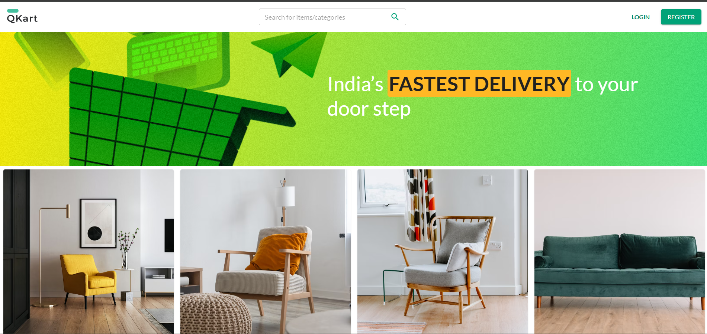
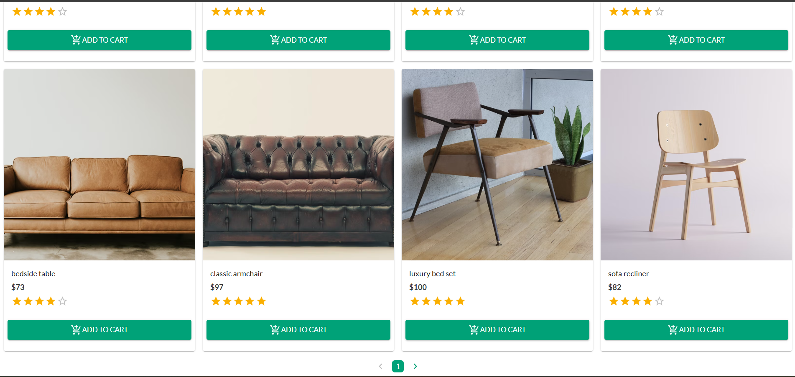
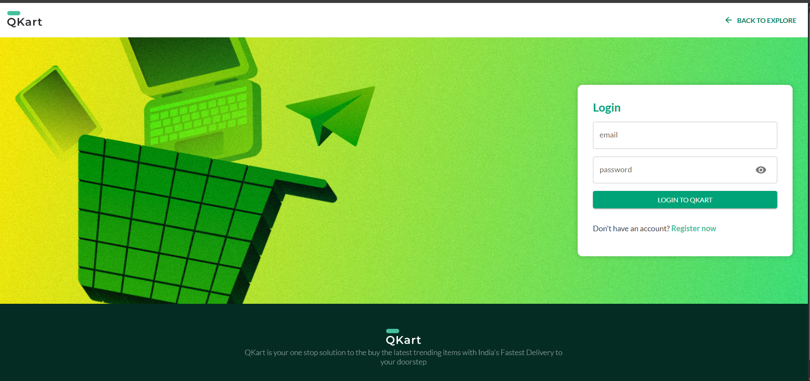
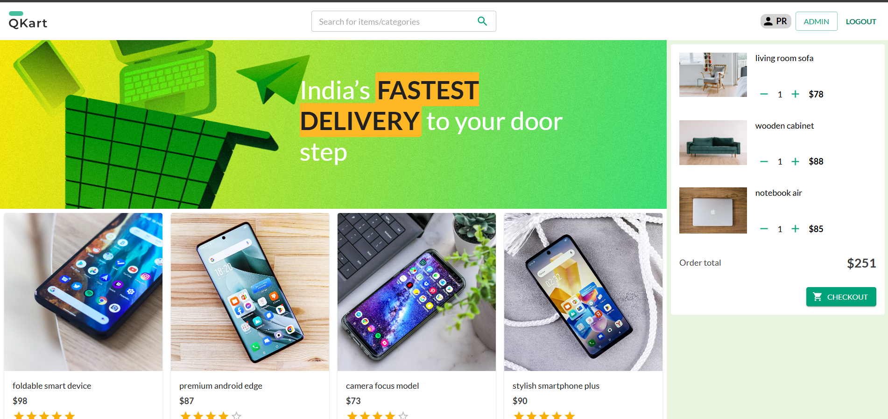
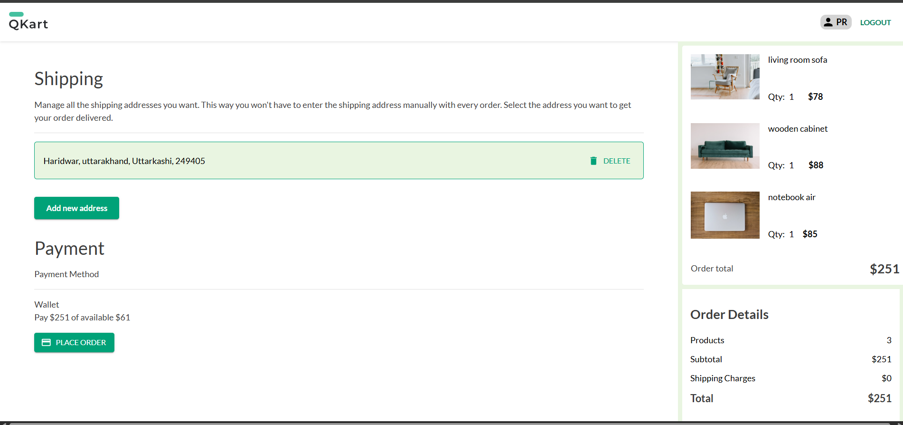
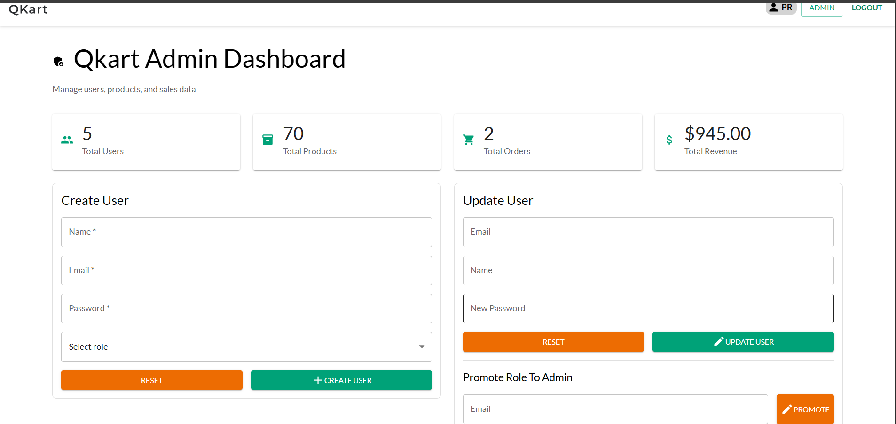
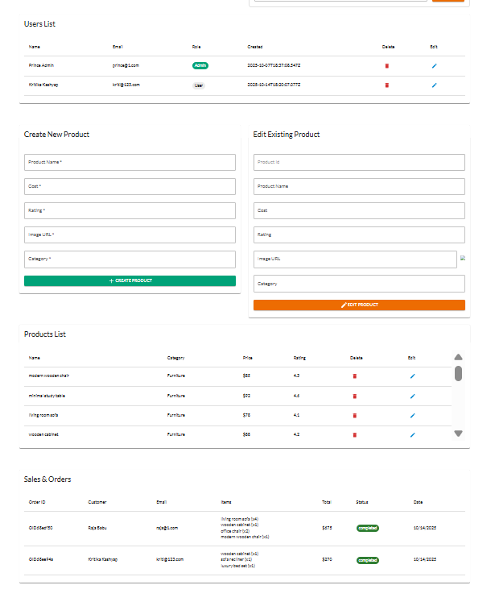

<h1 align="center">🛍️ QKart Frontend V2</h1>

<p align="center">
  &nbsp;&nbsp;&nbsp;
  &nbsp;&nbsp;&nbsp;
  &nbsp;&nbsp;&nbsp;
  &nbsp;&nbsp;&nbsp;
  &nbsp;&nbsp;&nbsp;
  
</p>

<p align="center">QKart Frontend is a modern e-commerce web app built using React 18, Vite, and Material UI v5, featuring both User and Admin interfaces.
It supports secure user authentication, product management, order handling, and admin control over users and products.</p>

🔗 **Live Demo:** [qkart-admin.app](https://qkart-frontend-v2-beryl.vercel.app/)
🔗 **Backend Repo:** [qkart-backend](https://github.com/princeprabhat/Qkart-Backend-v2)

---

<h3> 🚀 Tech Stack</h3>

- **Frontend:** React 18, Vite, Material UI v5

- **Routing:** React Router v6

- **HTTP Client:** Axios

- **State & Alerts:** React Hooks + Notistack

- **Styling:** Emotion (CSS-in-JS)

---

<h3>📂 Folder Structure</h3>

```
frontend/
├── src/
│   ├── components/        # Shared reusable UI components
│   ├── assets             # Static assets (images, icons)
│   ├── theme.js           # Material UI theme configuration
│   ├── App.jsx            # Main App component
│   └── main.jsx           # Entry point
│
|── index.html
│── vite.config.json
└── package.json

```

---

<h3>⚙️ Installation & Setup</h3>

```
# Clone the repo
git clone https://github.com/princeprabhat/Qkart-Frontend-v2.git
cd qkart-frontend

# Install dependencies
npm install

# Set environment variables
# Example: .env
VITE_ENVIRONMENT=development

# Run the app
npm run dev

# Open http://localhost:5173 in your browser

```

---

<h3> 🌐 Backend Environment Setup </h3>

```javascript
# src/config.js (example):

const prodUrl = "https://qkart-backend-v2-ku0s.onrender.com/api/v1";
const localUrl = "http://localhost:3000/api/v1";

export const config = {
  endpoint:  import.meta.env.VITE_ENVIRONMENT == "production" ? prodUrl : localUrl,
};

```

---

<h3> 📄 Major Pages inside components folder </h3>

- **Header :** Navigation bar with conditional buttons and navigation.
- **Register :** User registration with form validation.
- **Login :** User login with JWT authentication.
- **Product :** Product listing, filtering, and search functionalities with debouncing and pagination.
- **ProductCard :** Reusable product card component.
- **Cart :** Shopping cart management and checkout process.
- **Checkout :** Order review, address review and payment simulation.
- **Thanks :** Order confirmation page.
- **Admin :** Admin dashboard for managing products and users and sales data.
- **Footer :** Footer with links and information.
- **NotFound :** 404 page for undefined routes redirects to /.

#### Every page has their own CSS file inside the /components/ for clean custom styling.

---

<h3> 🧩 Features </h3>

#### 🧑‍💼 **User Side:**

- Register / Login
- View and search products
- Add/remove products to/from cart
- Checkout with address and payment simulation
- View order confirmation
- Responsive design for mobile and desktop

#### 🛠️ **Admin Side:**

- Admin login
- View, add, edit, and delete products
- View, add, edit, and delete users and profiles
- Manage roles and permissions
- View and manage orders
- View sales data and analytics
- Responsive design for mobile and desktop

---

<h3> 🪶 UI Highlights </h3>

- Clean and modern design with Material UI
- Responsive layout for all devices
- Intuitive navigation and user experience
- Consistent styling with custom themes
- MUI Data Tables for admin lists
- Snackbar notifications for user actions
- Loading indicators for async actions
- Form validation and error handling
- Smooth transitions and hover effects

---

<h3>🖼️ Screenshots</h3>















---

<h3> 👨‍💻 Author </h3>

## **Prince Prabhat**

[](https://www.linkedin.com/in/prince-prabhat-dev/)
[](https://github.com/princeprabhat)

**Full Stack Developer | MERN | Building scalable, modern apps with clean architecture.**
